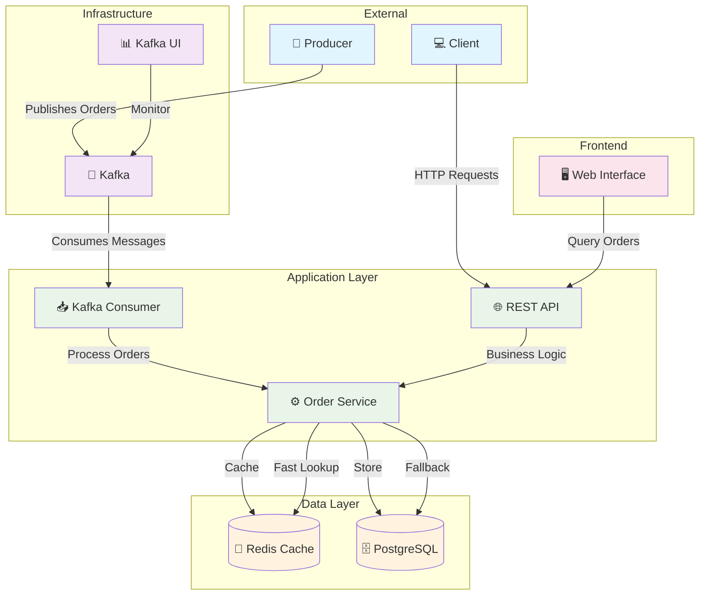

# 🛒 Wildberries L0 Order Management System

<div align="center">


**A high-performance, scalable order management system with real-time message processing**

[Features](#features) • [Architecture](#architecture) • [Quick Start](#quick-start) • [API](#api-reference) • [Contributing](#contributing)

</div>

---

## 📋 Table of Contents

- [🌟 Features](#features)
- [🏗️ Architecture](#architecture)
- [🚀 Quick Start](#quick-start)
- [📖 API Reference](#api-reference)
- [🛠️ Development](#development)
- [🔧 Configuration](#configuration)
---

## 🌟 Features

<table>
<tr>
<td width="50%">

### 🚀 **Performance & Scalability**
- **High-throughput** Kafka message processing
- **Sub-millisecond** Redis caching
- **Concurrent** order processing
- **Horizontal scaling** ready

</td>
<td width="50%">

### 🔧 **Modern Architecture**
- **Clean Architecture** pattern
- **Microservices** ready
- **Event-driven** design
- **Cloud-native** deployment

</td>
</tr>
<tr>
<td width="50%">

### 💾 **Data Management**
- **PostgreSQL** for persistent storage
- **Redis** for high-speed caching
- **ACID** transaction support
- **Data consistency** guarantees

</td>
<td width="50%">

### 🌐 **Integration & Monitoring**
- **RESTful API** endpoints
- **Real-time** order tracking
- **Kafka UI** for message monitoring
- **Health checks** and metrics

</td>
</tr>
</table>

---

## 🏗️ Architecture

<div align="center">



</div>

### 🔧 **Technology Stack**

| Component | Technology | Version | Purpose |
|-----------|------------|---------|---------|
| **Backend** | Go | 1.24.5 | High-performance API server |
| **Web Framework** | Gin | 1.10.0 | Fast HTTP routing & middleware |
| **Database** | PostgreSQL | 15 | ACID-compliant data persistence |
| **Cache** | Redis | 7 | High-speed data caching |
| **Message Broker** | Apache Kafka | 7.4.0 | Event streaming & processing |
| **Frontend** | Vanilla JS + Vite | 7.1.2 | Modern web interface |
| **Containerization** | Docker Compose | - | Multi-service orchestration |

---

## 🚀 Quick Start

### Prerequisites

- 🐳 [Docker](https://docs.docker.com/get-docker/) & [Docker Compose](https://docs.docker.com/compose/install/)
- 🔧 [Git](https://git-scm.com/downloads)
- 🌐 Modern web browser

### 1️⃣ Clone & Navigate

```bash
git clone https://github.com/makhkets/wildberries-l0.git
cd wildberries-l0
```

### 2️⃣ Start All Services

```bash
# Launch the entire stack
docker-compose up -d

# View logs (optional)
docker-compose logs -f
```

### 3️⃣ Verify Deployment

| Service | URL | Description |
|---------|-----|-------------|
| 🌐 **Backend API** | [http://localhost:8000](http://localhost:8000) | REST API server |
| 🖥️ **Frontend** | [http://localhost:3000](http://localhost:3000) | Web interface |
| 📊 **Kafka UI** | [http://localhost:8080](http://localhost:8080) | Message monitoring |
| ✅ **Health Check** | [http://localhost:8000/health](http://localhost:8000/health) | Service status |

### 4️⃣ Test the System

```bash
# Check API health
curl http://localhost:8000/health

# Query an order (example)
curl http://localhost:8000/api/order/b563feb7b2b84b6test
```

---

## 📖 API Reference

### 🔍 **Get Order by UID**

Retrieve detailed order information by unique identifier.

```http
GET /api/order/{order_uid}
```

#### Parameters

| Parameter | Type | Description |
|-----------|------|-------------|
| `order_uid` | `string` | **Required**. Unique order identifier |

#### Response

<details>
<summary>📄 <strong>Success Response (200 OK)</strong></summary>

```json
{
  "order_uid": "b563feb7b2b84b6test",
  "track_number": "WBILMTESTTRACK",
  "entry": "WBIL",
  "delivery": {
    "name": "Test Testov",
    "phone": "+9720000000",
    "zip": "2639809",
    "city": "Kiryat Mozkin",
    "address": "Ploshad Mira 15",
    "region": "Kraiot",
    "email": "test@gmail.com"
  },
  "payment": {
    "transaction": "b563feb7b2b84b6test",
    "request_id": "",
    "currency": "USD",
    "provider": "wbpay",
    "amount": 1817,
    "payment_dt": 1637907727,
    "bank": "alpha",
    "delivery_cost": 1500,
    "goods_total": 317,
    "custom_fee": 0
  },
  "items": [
    {
      "chrt_id": 9934930,
      "track_number": "WBILMTESTTRACK",
      "price": 453,
      "rid": "ab4219087a764ae0btest",
      "name": "Mascaras",
      "sale": 30,
      "size": "0",
      "total_price": 317,
      "nm_id": 2389212,
      "brand": "Vivienne Sabo",
      "status": 202
    }
  ],
  "locale": "en",
  "internal_signature": "",
  "customer_id": "test",
  "delivery_service": "meest",
  "shardkey": "9",
  "sm_id": 99,
  "date_created": "2021-11-26T06:22:19Z",
  "oof_shard": "1"
}
```

</details>

<details>
<summary>❌ <strong>Error Responses</strong></summary>

**404 Not Found**
```json
{
  "error": "Order not found",
  "code": 404
}
```

**500 Internal Server Error**
```json
{
  "error": "Internal server error",
  "code": 500
}
```

</details>

### 🏥 **Health Check**

Check service availability and dependencies.

```http
GET /health
```

#### Response

```json
{
  "status": "ok",
  "timestamp": "2024-01-15T10:30:00Z",
  "services": {
    "database": "ok",
    "cache": "ok",
    "kafka": "ok"
  }
}
```

---

## 🛠️ Development

### 🏃‍♂️ **Local Development**

#### Backend Development

```bash
cd backend

# Install dependencies
go mod download

# Run database migrations
make migrate-up

# Start development server
make dev
```

#### Frontend Development

```bash
cd frontend/wb-front

# Install dependencies
npm install

# Start development server
npm run dev
```

### 📁 **Project Structure**

```
wildberries-l0/
├── 🗂️ backend/
│   ├── 📂 cmd/                    # Application entrypoints
│   │   ├── main/                  # Main application
│   │   └── migrate/               # Database migration tool
│   ├── 📂 internal/               # Private application code
│   │   ├── api/                   # HTTP handlers & routing
│   │   ├── cache/                 # Redis cache layer
│   │   ├── config/                # Configuration management
│   │   ├── db/                    # Database layer
│   │   ├── kafka/                 # Kafka consumer
│   │   ├── model/                 # Data models
│   │   └── service/               # Business logic
│   ├── 📂 migrations/             # Database schema migrations
│   ├── 📂 pkg/                    # Public library code
│   └── 🐳 Dockerfile              # Backend container
├── 🗂️ frontend/wb-front/
│   ├── 📂 src/                    # Frontend source code
│   ├── 📄 index.html              # Main HTML file
│   └── 🐳 Dockerfile              # Frontend container
└── 🐳 docker-compose.yml          # Multi-service orchestration
```
---

## 🔧 Configuration

### 🌍 **Environment Variables**

| Variable | Default | Description |
|----------|---------|-------------|
| `API_PORT` | `8000` | API server port |
| `ENVIRONMENT` | `development` | Application environment |
| `POSTGRES_HOST` | `postgres` | PostgreSQL host |
| `POSTGRES_DB` | `wildberries` | Database name |
| `POSTGRES_USER` | `user` | Database username |
| `POSTGRES_PASSWORD` | `password` | Database password |
| `REDIS_HOST` | `redis` | Redis host |
| `REDIS_PORT` | `6379` | Redis port |
| `KAFKA_BROKERS` | `kafka:29092` | Kafka broker addresses |
| `KAFKA_TOPIC` | `orders` | Kafka topic name |
| `KAFKA_GROUP_ID` | `wildberries-consumer` | Consumer group ID |
